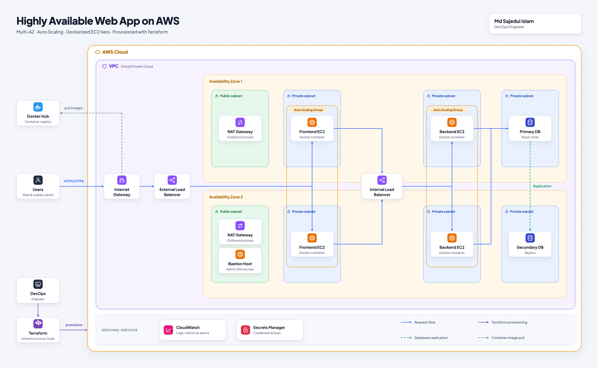

# AWS 3-Tier Architecture with Terraform

Highly available 3-tier web app on AWS (Node.js frontend, Go backend, PostgreSQL), provisioned with Terraform.



## What I Built

- Modular Terraform: VPC, Security Groups, IAM, ALB, ASG, RDS, Secrets Manager, Bastion
- VPC across 2 AZs with public, frontend, backend, and database subnets
- Public ALB → Frontend ASG → Internal ALB → Backend ASG → RDS PostgreSQL
- Dockerized EC2 tiers bootstrapped with `user_data`, images pulled from Docker Hub
- DB credentials in Secrets Manager, logs and alarms in CloudWatch
- Remote Terraform state in S3

## Clone

```bash
git clone https://github.com/sajedul5/aws-3-tier-architecture-terraform.git
cd aws-3-tier-architecture-terraform
```

## Run Locally

```bash
cd docker-local-deployment
docker compose up -d --build
```

Open http://localhost:3000

## Build and Push Images

```bash
docker login
./terraform-infra/scripts/build-and-push.sh <dockerhub-username>
```

> Images are built for `linux/amd64` to match the EC2 instances.

## Deploy to AWS

**1. Copy the variables file** and set `ssh_key_name`, `allowed_ssh_cidr`, and your Docker images:

```bash
cd terraform-infra
cp terraform.tfvars.example terraform.tfvars
```

**2. Change the S3 backend bucket** in `backend.tf` to your own bucket:

```hcl
terraform {
  backend "s3" {
    bucket       = "<your-s3-bucket-name>"   # change this
    key          = "aws-3-tier-architecture.tfstate"
    region       = "<bucket-region>"         # change this
    use_lockfile = true
    encrypt      = true
  }
}
```

**3. Deploy:**

```bash
terraform init
terraform plan
terraform apply
```

```bash
terraform output application_url
```

## Update the Application

```bash
./terraform-infra/scripts/build-and-push.sh <dockerhub-username>
aws autoscaling start-instance-refresh --auto-scaling-group-name dev-goal-tracker-frontend-asg
aws autoscaling start-instance-refresh --auto-scaling-group-name dev-goal-tracker-backend-asg
```

## Explore

```bash
terraform state list                              # all resources
terraform output                                  # outputs
aws elbv2 describe-target-health --target-group-arn <tg-arn>   # target health
aws ssm start-session --target <instance-id>      # shell into an instance
```

## Clean Up

```bash
terraform destroy
```

---

**Author:** Md Sajedul Islam, DevOps Engineer · **Stack:** Terraform | AWS | Docker | Node.js | Go | PostgreSQL
